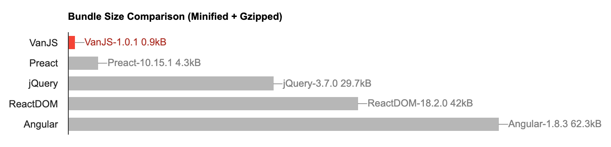

# 🍦 **VanJS**: The Smallest Reactive UI Framework in the World

📣 [Introducing VanX →](https://github.com/vanjs-org/van/discussions/144) <br>
📣 [Introducing VanJS App Builder →](https://github.com/vanjs-org/van/discussions/179)

<div align="center">
  <table>
    <tbody>
      <tr>
        <td>
          <a href="https://vanjs.org/start">🖊️ Get Started</a>
        </td>
        <td>
          <a href="https://vanjs.org/tutorial">📖 Tutorial</a>
        </td>
        <td>
          <a href="https://vanjs.org/demo">📚 Examples</a>
        </td>
        <td>
          <a href="https://vanjs.org/convert">📝 HTML/MD to VanJS Converter</a>
        </td>
        <td>
          <a href="https://vanjs.org/x">⚔️ VanX</a>
        </td>
        <td>
          <a href="https://github.com/vanjs-org/van/discussions">💬 Discuss</a>
        </td>
      </tr>
    </tbody>
  </table>
</div>

> Enable everyone to build useful UI apps with a few lines of code, anywhere, any time, on any device.

**VanJS** is an ***ultra-lightweight***, ***zero-dependency*** and ***unopinionated*** Reactive UI framework based on pure vanilla JavaScript and DOM. Programming with **VanJS** feels like building React apps in a [scripting language](https://vanjs.org/about#story), without JSX. Check-out the `Hello World` code below:

```javascript
// Reusable components can be just pure vanilla JavaScript functions.
// Here we capitalize the first letter to follow React conventions.
const Hello = () => div(
  p("👋Hello"),
  ul(
    li("🗺️World"),
    li(a({href: "https://vanjs.org/"}, "🍦VanJS")),
  ),
)

van.add(document.body, Hello())
// Alternatively, you can write:
// document.body.appendChild(Hello())
```

[Try on jsfiddle](https://jsfiddle.net/gh/get/library/pure/vanjs-org/vanjs-org.github.io/tree/master/jsfiddle/home/hello)

You can convert any HTML or MD snippet into **VanJS** code with our online [converter](https://vanjs.org/convert).

**VanJS** helps you manage states and UI bindings as well, with a more natural API:

```javascript
const Counter = () => {
  const counter = van.state(0)
  return div(
    "❤️ ", counter, " ",
    button({onclick: () => ++counter.val}, "👍"),
    button({onclick: () => --counter.val}, "👎"),
  )
}

van.add(document.body, Counter())
```

[Try on jsfiddle](https://jsfiddle.net/gh/get/library/pure/vanjs-org/vanjs-org.github.io/tree/master/jsfiddle/home/counter)

## Why VanJS?

### Reactive Programming without React/JSX

Declarative DOM tree composition, reusable components, reactive state binding - **VanJS** offers every good aspect that React does, but without the need of React, JSX, transpiling, virtual DOM, or any hidden logic. Everything is built with simple JavaScript functions and DOM.

### Grab 'n Go

***No installation***, ***no configuration***, ***no dependencies***, ***no transpiling***, ***no IDE setups***. Adding a line to your script or HTML file is all you need to start coding. And any code with **VanJS** can be pasted and executed directly in your browser's developer console. **VanJS** allows you to focus on the business logic of your application, rather than getting bogged down in frameworks and tools.

### Ultra-Lightweight

**VanJS** is the smallest reactive UI framework in the world, with just 1.0kB in the gzipped minified bundle. It's **50~100 times** smaller than most popular alternatives. Guess what you can get from this 1.0kB framework? All essential features of modern web frameworks - DOM templating, state, state binding, state derivation, effect, SPA, client-side routing and even hydration!



> _Perfection is achieved, not when there is nothing more to add, but when there is nothing left to take away._
>
> _-- Antoine de Saint-Exupéry, Airman's Odyssey_

### Easy to Learn

Simplicity at its core. Only 5 functions (`van.tags`, `van.add`, `van.state`, `van.derive`, `van.hydrate`). The entire tutorial plus the API reference is [just one single web page](https://vanjs.org/tutorial), and can be learned within 1 hour for most developers.

### Performance

**VanJS** is among the fastest web frameworks, according to the [results](https://krausest.github.io/js-framework-benchmark/2023/table_chrome_117.0.5938.62.html) by [krausest/js-framework-benchmark](https://github.com/krausest/js-framework-benchmark). For SSR, **Mini-Van** is [**1.75X** to **2.25X** more efficient](https://github.com/vanjs-org/mini-van/tree/main/bench#react-vs-mini-van) compared to React.

### TypeScript Support

**VanJS** provides first-class support for TypeScript. With the `.d.ts` file in place, you'll be able to take advantage of type-checking, IntelliSense, large-scale refactoring provided by your preferred development environment. Refer to the [Download Table](https://vanjs.org/start#download-table) to find the right `.d.ts` file to work with.

## Want to Learn More?

* [Get Started](https://vanjs.org/start) (CDN, NPM or local download)
* Learn from the [Tutorial](https://vanjs.org/tutorial)
* Learn by [Examples](https://vanjs.org/demo) (and also [Community Examples](https://vanjs.org/demo#community-examples))
* Get bored? [Play a fun game](https://vanjs.org/demo#game) built with **VanJS** under 60 lines
* Convert HTML or MD snippet to **VanJS** code with our online [HTML/MD to **VanJS** Converter](https://vanjs.org/convert)
* Check out [**VanUI**](https://github.com/vanjs-org/van/tree/main/components) - A collection of grab 'n go reusable utility and UI components for **VanJS**
* Check out [**VanX**](https://vanjs.org/x) - The 1.0 kB official **VanJS** extension
* Want server-side rendering? Check out [**Mini-Van**](https://github.com/vanjs-org/mini-van) and [Hydration](https://vanjs.org/ssr) (the entire [vanjs.org](https://vanjs.org/) site is built on top of **Mini-Van**)
* For questions, feedback or general discussions, visit our [Discussions](https://github.com/vanjs-org/van/discussions) page
* [How did **VanJS** get its name?](https://vanjs.org/about#name)

## IDE Plug-ins

* [VS Code Extension](https://marketplace.visualstudio.com/items?itemName=TaoXin.vanjs-importtag)

## See Also

[A Guide to Reading **VanJS** Codebase](https://vanjs.org/about#source-guide)

## Support & Feedback

🙏 **VanJS** aims to build a better world by reducing the entry barrier of UI programming, with no intention or plan on commercialization whatsoever. If you find **VanJS** interesting, or could be useful for you some day, please consider starring the project. It takes just a few seconds but your support means the world to us and helps spread **VanJS** to a wider audience.

> In the name of **Van**illa of the House **J**ava**S**cript, [the First of its name](https://vanjs.org/about#name), Smallest Reactive UI Framework, 1.0kB JSX-free Grab 'n Go Library, [Scripting Language](https://vanjs.org/about#story) for GUI, [GPT-Empowered](https://chat.openai.com/g/g-7tcSHUu27-vanjs-app-builder) Toolkit, by the word of Tao of the House Xin, Founder and Maintainer of **VanJS**, I do hereby grant you the permission of **VanJS** under [MIT License](https://github.com/vanjs-org/van/blob/main/LICENSE).

Contact us: [@taoxin](https://twitter.com/intent/follow?region=follow_link&screen_name=taoxin) / [tao@vanjs.org](mailto:tao@vanjs.org) / [Tao Xin](https://www.linkedin.com/in/tao-xin-64234920/)

## Community Add-ons

**VanJS** can be extended via add-ons. Add-ons add more features to **VanJS** and/or provide an alternative styled API. Below is a curated list of add-ons built by **VanJS** community:

| Add-on | Description | Author |
| ------ | ----------- | ------ |
| [Van Cone](https://medium-tech.github.io/van-cone-website/) | An SPA framework add-on for **VanJS** | [b-rad-c](https://github.com/b-rad-c) |
| [van_element](/addons/van_element/) | Web Components with **VanJS** | [Atmos4](https://github.com/Atmos4) |
| [van_dml.js](/addons/van_dml) | A new flavour of composition for **VanJS** | [Eckehard](https://github.com/efpage) |
| [van-jsx](/addons/van_jsx) | A JSX wrapper for **VanJS**, for people who like the JSX syntax more | [cqh963852](https://github.com/cqh963852) |
| [vanjs-router](https://github.com/iuroc/vanjs-router) | A router solution for **VanJS** (`README.md` in simplified Chinese) | [欧阳鹏](https://github.com/iuroc) |
| [VanJS Routing](https://github.com/kwameopareasiedu/vanjs-routing) | Yet another routing solution for **VanJS** | [Kwame Opare Asiedu](https://github.com/kwameopareasiedu) |
| [VanJS Form](https://github.com/kwameopareasiedu/vanjs-form) | Fully typed form state management library (with validation) for **VanJS** | [Kwame Opare Asiedu](https://github.com/kwameopareasiedu) |
| [vanjs-bootstrap](https://github.com/WilliCommer/vanjs-bootstrap) | **VanJS** Bootstrap Components | [Willi Commer](https://github.com/WilliCommer) |
| [vanrx](https://github.com/MeddahAbdellah/vanrx) | An ultra-lightweight Redux addon for **VanJS** | [Meddah Abdallah](https://github.com/MeddahAbdellah) |

## Contributors (49)

*If I miss anyone's contribution here, apologies for my oversight 🙏, please comment on [#87](https://github.com/vanjs-org/van/issues/87) to let me know.*

[Emoji key](https://allcontributors.org/docs/en/emoji-key)

<!-- ALL-CONTRIBUTORS-LIST:START - Do not remove or modify this section -->
<!-- prettier-ignore-start -->
<!-- markdownlint-disable -->
<table>
  <tbody>
    <tr>
      <td align="center" valign="top" width="14.28%"><a href="http://vanjs.org"><br /><sub><b>Tao Xin</b></sub></a><br /><a href="#design-Tao-VanJS" title="Design">🎨</a> <a href="https://github.com/vanjs-org/van/commits?author=Tao-VanJS" title="Code">💻</a> <a href="https://github.com/vanjs-org/van/commits?author=Tao-VanJS" title="Documentation">📖</a> <a href="#example-Tao-VanJS" title="Examples">💡</a></td>
      <td align="center" valign="top" width="14.28%"><a href="https://sunxiunan.com/"><br /><sub><b>Wei Sun</b></sub></a><br /><a href="https://github.com/vanjs-org/van/issues?q=author%3Asaga" title="Bug reports">🐛</a></td>
      <td align="center" valign="top" width="14.28%"><a href="https://github.com/ryanolsonx"><br /><sub><b>Ryan Olson</b></sub></a><br /><a href="#content-ryanolsonx" title="Content">🖋</a></td>
      <td align="center" valign="top" width="14.28%"><a href="http://tamo.tdiary.net/"><br /><sub><b>Tamotsu Takahashi</b></sub></a><br /><a href="https://github.com/vanjs-org/van/commits?author=tamo" title="Code">💻</a></td>
      <td align="center" valign="top" width="14.28%"><a href="https://lichess.org/@/StevenEmily"><br /><sub><b>icecream17</b></sub></a><br /><a href="https://github.com/vanjs-org/van/commits?author=icecream17" title="Code">💻</a></td>
      <td align="center" valign="top" width="14.28%"><a href="http://enpitsulin.xyz"><br /><sub><b>enpitsulin</b></sub></a><br /><a href="#example-enpitsuLin" title="Examples">💡</a> <a href="https://github.com/vanjs-org/van/commits?author=enpitsuLin" title="Code">💻</a></td>
      <td align="center" valign="top" width="14.28%"><a href="https://github.com/EFord36"><br /><sub><b>Elliot Ford</b></sub></a><br /><a href="https://github.com/vanjs-org/van/commits?author=EFord36" title="Code">💻</a></td>
    </tr>
    <tr>
      <td align="center" valign="top" width="14.28%"><a href="https://github.com/andrewgryan"><br /><sub><b>andrewgryan</b></sub></a><br /><a href="#design-andrewgryan" title="Design">🎨</a> <a href="https://github.com/vanjs-org/van/commits?author=andrewgryan" title="Code">💻</a> <a href="https://github.com/vanjs-org/van/issues?q=author%3Aandrewgryan" title="Bug reports">🐛</a></td>
      <td align="center" valign="top" width="14.28%"><a href="http://fr.linkedin.com/in/fredericheem"><br /><sub><b>FredericH</b></sub></a><br /><a href="#example-FredericHeem" title="Examples">💡</a> <a href="https://github.com/vanjs-org/van/commits?author=FredericHeem" title="Code">💻</a></td>
      <td align="center" valign="top" width="14.28%"><a href="https://github.com/ebraminio"><br /><sub><b>ebraminio</b></sub></a><br /><a href="https://github.com/vanjs-org/van/commits?author=ebraminio" title="Code">💻</a> <a href="https://github.com/vanjs-org/van/commits?author=ebraminio" title="Tests">⚠️</a></td>
      <td align="center" valign="top" width="14.28%"><a href="http://www.efpage.de"><br /><sub><b>Eckehard</b></sub></a><br /><a href="https://github.com/vanjs-org/van/commits?author=efpage" title="Code">💻</a> <a href="#plugin-efpage" title="Plugin/utility libraries">🔌</a></td>
      <td align="center" valign="top" width="14.28%"><a href="https://onsclom.net"><br /><sub><b>Austin Merrick</b></sub></a><br /><a href="https://github.com/vanjs-org/van/commits?author=onsclom" title="Code">💻</a> <a href="#ideas-onsclom" title="Ideas, Planning, & Feedback">🤔</a> <a href="#design-onsclom" title="Design">🎨</a></td>
      <td align="center" valign="top" width="14.28%"><a href="https://tolluset.gitbook.io/wiki/"><br /><sub><b>Lee Byonghun</b></sub></a><br /><a href="https://github.com/vanjs-org/van/commits?author=Tolluset" title="Code">💻</a></td>
      <td align="center" valign="top" width="14.28%"><a href="http://caputdraconis.tistory.com"><br /><sub><b>caputdraconis</b></sub></a><br /><a href="https://github.com/vanjs-org/van/commits?author=caputdraconis050630" title="Code">💻</a></td>
    </tr>
    <tr>
      <td align="center" valign="top" width="14.28%"><a href="https://github.com/pomdtr"><br /><sub><b>Achille Lacoin</b></sub></a><br /><a href="https://github.com/vanjs-org/van/commits?author=pomdtr" title="Code">💻</a></td>
      <td align="center" valign="top" width="14.28%"><a href="https://github.com/cqh963852"><br /><sub><b>cqh</b></sub></a><br /><a href="https://github.com/vanjs-org/van/commits?author=cqh963852" title="Code">💻</a> <a href="#plugin-cqh963852" title="Plugin/utility libraries">🔌</a></td>
      <td align="center" valign="top" width="14.28%"><a href="https://github.com/awesome-club"><br /><sub><b>awesome</b></sub></a><br /><a href="#video-awesome-club" title="Videos">📹</a></td>
      <td align="center" valign="top" width="14.28%"><a href="https://github.com/artydev"><br /><sub><b>artydev</b></sub></a><br /><a href="#example-artydev" title="Examples">💡</a> <a href="#question-artydev" title="Answering Questions">💬</a></td>
      <td align="center" valign="top" width="14.28%"><a href="https://github.com/ndrean"><br /><sub><b>Neven DREAN</b></sub></a><br /><a href="#example-ndrean" title="Examples">💡</a> <a href="https://github.com/vanjs-org/van/issues?q=author%3Andrean" title="Bug reports">🐛</a></td>
      <td align="center" valign="top" width="14.28%"><a href="https://person.sh"><br /><sub><b>Stephen Handley</b></sub></a><br /><a href="#example-stephenhandley" title="Examples">💡</a></td>
      <td align="center" valign="top" width="14.28%"><a href="http://gion.ro"><br /><sub><b>Ionut Stoica</b></sub></a><br /><a href="#ideas-iongion" title="Ideas, Planning, & Feedback">🤔</a></td>
    </tr>
    <tr>
      <td align="center" valign="top" width="14.28%"><a href="https://twitter.com/mindplaydk"><br /><sub><b>Rasmus Schultz</b></sub></a><br /><a href="#ideas-mindplay-dk" title="Ideas, Planning, & Feedback">🤔</a></td>
      <td align="center" valign="top" width="14.28%"><a href="https://github.com/cloudspeech"><br /><sub><b>cloudspeech</b></sub></a><br /><a href="#ideas-cloudspeech" title="Ideas, Planning, & Feedback">🤔</a></td>
      <td align="center" valign="top" width="14.28%"><a href="http://danielupshaw.com/"><br /><sub><b>Daniel Upshaw</b></sub></a><br /><a href="#plugin-groovenectar" title="Plugin/utility libraries">🔌</a></td>
      <td align="center" valign="top" width="14.28%"><a href="https://github.com/barrymun"><br /><sub><b>barrymun</b></sub></a><br /><a href="#example-barrymun" title="Examples">💡</a></td>
      <td align="center" valign="top" width="14.28%"><a href="https://github.com/eevleevs"><br /><sub><b>Giulio Malventi</b></sub></a><br /><a href="#content-eevleevs" title="Content">🖋</a> <a href="https://github.com/vanjs-org/van/issues?q=author%3Aeevleevs" title="Bug reports">🐛</a></td>
      <td align="center" valign="top" width="14.28%"><a href="https://github.com/yahia-berashish"><br /><sub><b>Yahia Berashish</b></sub></a><br /><a href="https://github.com/vanjs-org/van/issues?q=author%3Ayahia-berashish" title="Bug reports">🐛</a> <a href="https://github.com/vanjs-org/van/commits?author=yahia-berashish" title="Code">💻</a> <a href="#plugin-yahia-berashish" title="Plugin/utility libraries">🔌</a> <a href="#ideas-yahia-berashish" title="Ideas, Planning, & Feedback">🤔</a> <a href="#example-yahia-berashish" title="Examples">💡</a></td>
      <td align="center" valign="top" width="14.28%"><a href="http://metaleap.net"><br /><sub><b>Phil Schumann</b></sub></a><br /><a href="https://github.com/vanjs-org/van/issues?q=author%3Ametaleap" title="Bug reports">🐛</a></td>
    </tr>
    <tr>
      <td align="center" valign="top" width="14.28%"><a href="https://duffscs.github.io/blog/"><br /><sub><b>Raphaël Gauthier</b></sub></a><br /><a href="https://github.com/vanjs-org/van/commits?author=Duffscs" title="Code">💻</a> <a href="#plugin-Duffscs" title="Plugin/utility libraries">🔌</a></td>
      <td align="center" valign="top" width="14.28%"><a href="https://hunter-gu.github.io/personal-blog/"><br /><sub><b>Nail</b></sub></a><br /><a href="https://github.com/vanjs-org/van/commits?author=Hunter-Gu" title="Code">💻</a> <a href="#plugin-Hunter-Gu" title="Plugin/utility libraries">🔌</a></td>
      <td align="center" valign="top" width="14.28%"><a href="https://github.com/btakita"><br /><sub><b>Brian Takita</b></sub></a><br /><a href="https://github.com/vanjs-org/van/issues?q=author%3Abtakita" title="Bug reports">🐛</a> <a href="#ideas-btakita" title="Ideas, Planning, & Feedback">🤔</a></td>
      <td align="center" valign="top" width="14.28%"><a href="https://github.com/jfillmore"><br /><sub><b>Jonny Fillmore</b></sub></a><br /><a href="https://github.com/vanjs-org/van/issues?q=author%3Ajfillmore" title="Bug reports">🐛</a></td>
      <td align="center" valign="top" width="14.28%"><a href="https://github.com/limaneto"><br /><sub><b>Lima Neto</b></sub></a><br /><a href="#content-limaneto" title="Content">🖋</a></td>
      <td align="center" valign="top" width="14.28%"><a href="https://github.com/b-rad-c"><br /><sub><b>b rad c</b></sub></a><br /><a href="https://github.com/vanjs-org/van/commits?author=b-rad-c" title="Code">💻</a> <a href="#plugin-b-rad-c" title="Plugin/utility libraries">🔌</a></td>
      <td align="center" valign="top" width="14.28%"><a href="https://apee.top"><br /><sub><b>欧阳鹏</b></sub></a><br /><a href="#plugin-iuroc" title="Plugin/utility libraries">🔌</a> <a href="#video-iuroc" title="Videos">📹</a></td>
    </tr>
    <tr>
      <td align="center" valign="top" width="14.28%"><a href="https://github.com/DanielMazurkiewicz"><br /><sub><b>Daniel Mazurkiewicz</b></sub></a><br /><a href="https://github.com/vanjs-org/van/commits?author=DanielMazurkiewicz" title="Code">💻</a></td>
      <td align="center" valign="top" width="14.28%"><a href="https://github.com/Atmos4"><br /><sub><b>Atmos4</b></sub></a><br /><a href="https://github.com/vanjs-org/van/commits?author=Atmos4" title="Code">💻</a> <a href="#plugin-Atmos4" title="Plugin/utility libraries">🔌</a></td>
      <td align="center" valign="top" width="14.28%"><a href="https://github.com/kwameopareasiedu"><br /><sub><b>Kwame Opare Asiedu</b></sub></a><br /><a href="#plugin-kwameopareasiedu" title="Plugin/utility libraries">🔌</a> <a href="#example-kwameopareasiedu" title="Examples">💡</a></td>
      <td align="center" valign="top" width="14.28%"><a href="https://github.com/ali-alnasser570"><br /><sub><b>ali-alnasser570</b></sub></a><br /><a href="#ideas-ali-alnasser570" title="Ideas, Planning, & Feedback">🤔</a></td>
      <td align="center" valign="top" width="14.28%"><a href="http://blog.auryn.dev"><br /><sub><b>Auryn Engel</b></sub></a><br /><a href="#video-auryn31" title="Videos">📹</a></td>
      <td align="center" valign="top" width="14.28%"><a href="https://github.com/mrwyndham"><br /><sub><b>Samuel Wyndham</b></sub></a><br /><a href="#video-mrwyndham" title="Videos">📹</a></td>
      <td align="center" valign="top" width="14.28%"><a href="https://github.com/sekoyo"><br /><sub><b>sekoyo</b></sub></a><br /><a href="https://github.com/vanjs-org/van/issues?q=author%3Asekoyo" title="Bug reports">🐛</a></td>
    </tr>
    <tr>
      <td align="center" valign="top" width="14.28%"><a href="https://github.com/OFurnell"><br /><sub><b>Owen Furnell</b></sub></a><br /><a href="https://github.com/vanjs-org/van/issues?q=author%3AOFurnell" title="Bug reports">🐛</a></td>
      <td align="center" valign="top" width="14.28%"><a href="https://github.com/MrVoltz"><br /><sub><b>MrVoltz</b></sub></a><br /><a href="https://github.com/vanjs-org/van/issues?q=author%3AMrVoltz" title="Bug reports">🐛</a></td>
      <td align="center" valign="top" width="14.28%"><a href="https://omnith.com"><br /><sub><b>Kane</b></sub></a><br /><a href="#example-csm-kb" title="Examples">💡</a></td>
      <td align="center" valign="top" width="14.28%"><a href="https://github.com/sirenkovladd"><br /><sub><b>Vlad Sirenko</b></sub></a><br /><a href="#example-SirenkoVladd" title="Examples">💡</a></td>
      <td align="center" valign="top" width="14.28%"><a href="https://github.com/CodeByZack"><br /><sub><b>董凯</b></sub></a><br /><a href="#example-CodeByZack" title="Examples">💡</a></td>
      <td align="center" valign="top" width="14.28%"><a href="https://github.com/MeddahAbdellah"><br /><sub><b>Meddah Abdallah</b></sub></a><br /><a href="#plugin-MeddahAbdellah" title="Plugin/utility libraries">🔌</a></td>
      <td align="center" valign="top" width="14.28%"><a href="https://github.com/creatormir"><br /><sub><b>Miroslaw</b></sub></a><br /><a href="https://github.com/vanjs-org/van/issues?q=author%3Acreatormir" title="Bug reports">🐛</a></td>
    </tr>
  </tbody>
</table>

<!-- markdownlint-restore -->
<!-- prettier-ignore-end -->

<!-- ALL-CONTRIBUTORS-LIST:END -->
