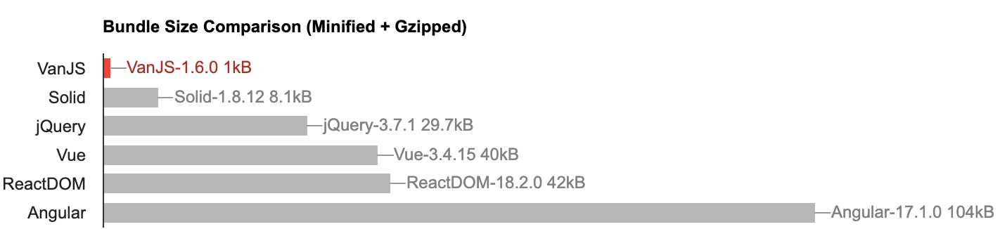

# 🍦 **VanJS**: The Smallest Reactive UI Framework in the World

📣 [VanJS 0.11.11 released →](https://github.com/vanjs-org/van/discussions/44)

> Enable everyone to build useful UI apps with a few lines of code, anywhere, any time, on any device.

**VanJS** is an ***ultra-lightweight***, ***zero-dependency*** and ***unopinionated*** Reactive UI framework based on pure vanilla JavaScript and DOM. Programming with **VanJS** feels like building React apps in a [scripting language](https://vanjs.org/about#story), without JSX. Check-out the `Hello World` code below:

```javascript
// Reusable components can be just pure vanilla JavaScript functions.
// Here we capitalize the first letter to follow React conventions.
const Hello = () => div(
  p("👋Hello"),
  ul(
    li("🗺️World"),
    li(a({href: "https://vanjs.org/"}, "🍦VanJS")),
  ),
)

van.add(document.body, Hello())
// Alternatively, you can write:
// document.body.appendChild(Hello())
```

[Try on jsfiddle](https://jsfiddle.net/gh/get/library/pure/vanjs-org/vanjs-org.github.io/tree/master/jsfiddle/home/hello)

You can convert any HTML snippet into **VanJS** code with our online [converter](https://vanjs.org/convert).

**VanJS** helps you manage states and UI bindings as well, with a more natural API:

```javascript
const Counter = () => {
  const counter = van.state(0)
  return div(
    "❤️ ", counter, " ",
    button({onclick: () => ++counter.val}, "👍"),
    button({onclick: () => --counter.val}, "👎"),
  )
}

van.add(document.body, Counter())
```

[Try on jsfiddle](https://jsfiddle.net/gh/get/library/pure/vanjs-org/vanjs-org.github.io/tree/master/jsfiddle/home/counter)

## Why VanJS?

### Reactive Programming without React/JSX

Declarative DOM tree composition, reusable components, reactive state binding - **VanJS** offers every good aspect that React does, but without the need of React, JSX, transpiling, virtual DOM, or any hidden logic. Everything is built with simple JavaScript functions and DOM.

### Grab 'n Go

***No installation***, ***no configuration***, ***no 3rd-party dependencies***, ***no transpiling***, ***no IDE setups***. Adding a line to your script or HTML file is all you need to start coding. **VanJS** allows you to focus on the business logic of your application, rather than getting bogged down in frameworks and tools.

### Ultra-Lightweight

**VanJS** is a very thin layer on top of Vanilla JavaScript and DOM, barely enough to make the DOM manipulation and state binding as ergonomic as (if not more than) React, and it delegates most of work to standard browser APIs implemented in native code. As a result, the bundled size of **VanJS** is just 1.3kB, which is **more than 100 times** smaller than most popular UI frameworks, making it the smallest reactive UI framework in the world:



> _Perfection is achieved, not when there is nothing more to add, but when there is nothing left to take away._
>
> _-- Antoine de Saint-Exupéry, Airman's Odyssey_

### TypeScript Support

**VanJS** provides first-class support for TypeScript. Simply download the corresponding `.d.ts` file along with your `.js` file, and you'll be able to take advantage of type-checking, IntelliSense, large-scale refactoring provided by your preferred development environment. Refer to the [Download Table](https://vanjs.org/start#download-table) to find the right `.d.ts` file to work with.

### Easy to Learn

**VanJS** puts heavy emphasis on the simplicity of the framework. There are only 5 exported functions in the API and feels a lot like React. Because of that, the [walkthrough tutorial](https://vanjs.org/tutorial) is the same as the full API reference, and can be learned within 1 hour for most developers.

## Want to Learn More?

* Download and [Get Started](https://vanjs.org/start)
* Learn from the [Tutorial](https://vanjs.org/tutorial)
* Learn by [Examples](https://vanjs.org/demo) (and also [Community Examples](https://vanjs.org/demo#community-examples))
* Convert HTML snippet to **VanJS** code with our online [HTML to **VanJS** Converter](https://vanjs.org/convert)
* Want server-side rendering? Check out [Mini-Van](https://github.com/vanjs-org/mini-van) (the entire vanjs.org site is built on top of Mini-Van)
* For questions, feedback or general discussions, visit our [Discussions](https://github.com/vanjs-org/van/discussions) page
* [How did **VanJS** get its name?](https://vanjs.org/about#name)

## Support & Feedback

🙏 **VanJS** aims to build a better world by reducing the entry barrier for UI programming, with no intention or plan on commercialization whatsoever. If you find **VanJS** interesting, or could be useful for you some day, please consider starring the project. It takes just a few seconds but your support means the world to us and helps spread **VanJS** to a wider audience.

We're looking for the 1.0 milestone (commitment to API stability) soon, your precious feedback will be greatly appreciated. You can submit your feedback in our [Discussions](https://github.com/vanjs-org/van/discussions) page.

Contact us: [tao@vanjs.org](mailto:tao@vanjs.org) / [Tao Xin](https://www.linkedin.com/in/tao-xin-64234920/)

## Contributors

*Ordered chronologically by first contribution:*

* [Tao Xin](https://github.com/Tao-VanJS)
* [Ryan Olson](https://github.com/ryanolsonx)
* [Tamotsu Takahashi](https://github.com/tamo)
* [icecream17](https://github.com/icecream17)
* [enpitsuLin](https://github.com/enpitsuLin)
* [Elliot Ford](https://github.com/EFord36)
* [andrewgryan](https://github.com/andrewgryan)
